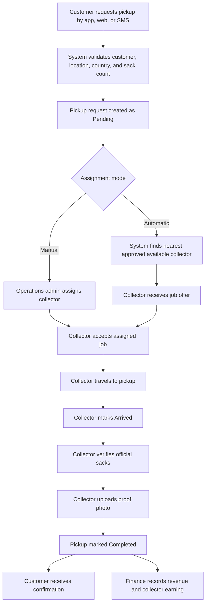
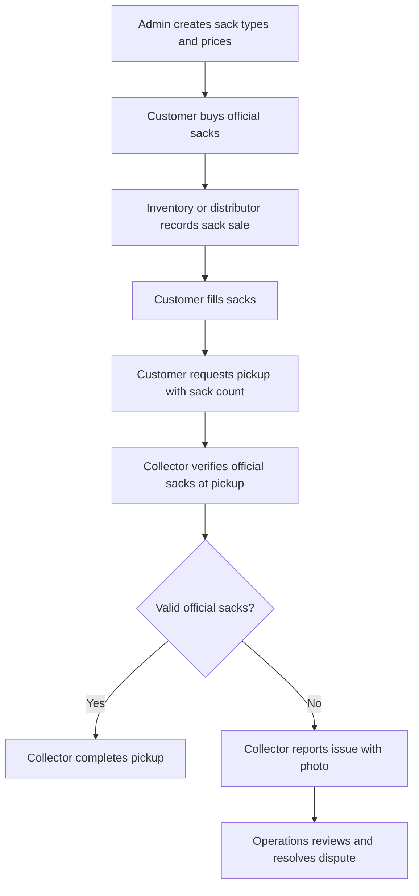
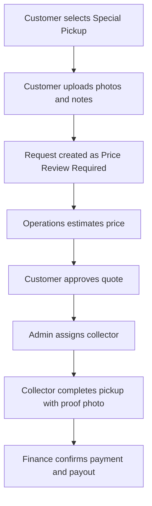
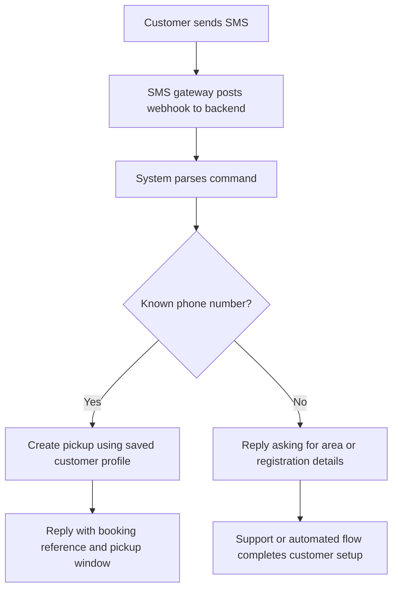

# Product Flow & Separate Web Panels

## Product Vision

The platform is an Uber-style waste collection marketplace where independent collectors fulfill customer pickup requests. The system must prioritize operational efficiency before customer-facing polish, because the business needs to approve collectors, manage requests, assign jobs, verify completion, and monitor payments from day one.

The system starts in Ghana and should be designed to expand into Nigeria and Côte d'Ivoire without rebuilding the core product.

## Main User Roles

| Role | Primary Goal | Web Panel |
| --- | --- | --- |
| Super Admin | Configure countries, currencies, payment providers, platform settings | Super Admin Panel |
| Operations Admin | Manage daily pickups, collectors, assignments, tracking, disputes | Operations Panel |
| Finance Admin | Monitor payments, wallets, cash reconciliation, collector payouts | Finance Panel |
| Support Agent | Help customers and collectors, resolve issues, view proof photos | Support Panel |
| Collector | Accept jobs, update job status, upload proof, view earnings | Collector Web Panel |
| Customer | Request pickup, buy sacks, track jobs, view history, pay invoices | Customer Web Panel |

## End-to-End Pickup Flow



## Official Sack Business Flow

Customers should only receive service for official company-issued sacks. This makes the platform different from generic garbage collection apps and protects revenue.



Recommended starting sack types:

| Sack Type | Example Price | Notes |
| --- | ---: | --- |
| Small Sack | $2 equivalent in local currency | Household light waste |
| Medium Sack | $4 equivalent in local currency | Standard household waste |
| Large Sack | $6 equivalent in local currency | Higher-volume household waste |

Pricing should be stored per country and currency. For example, Ghana should use GHS, Nigeria should use NGN, and Côte d'Ivoire should use XOF.

## Special Pickup Flow

Special pickups cover furniture, construction waste, bulk waste, or any request that does not fit the normal sack-based model.



## SMS Booking Flow

The system must support customers with feature phones. SMS requests should create the same pickup records used by web and mobile channels.

Example SMS command:

```text
PICKUP 3 SACKS
```



## Web Panel Separation

### 1. Super Admin Panel

Purpose: control the platform across all countries.

Key screens:

- Country management: Ghana, Nigeria, Côte d'Ivoire
- Currency management: GHS, NGN, XOF, USD equivalent references
- City and service zone setup
- Payment provider setup by country
- SMS provider setup by country
- Global roles and permissions
- Commission and payout rules
- Audit logs

### 2. Operations Panel

Purpose: run the daily waste collection business.

Key screens:

- Live operations dashboard
- Pickup request list with filters for pending, assigned, in-progress, completed, cancelled, disputed
- Manual assignment board
- Auto-assignment override screen
- Collector map and online status
- Pickup proof photo review
- Special pickup quote review
- Customer issue queue
- Daily operations report

Recommended dashboard cards:

- Pending pickups
- Pickups requiring assignment
- Active collectors online
- Completed pickups today
- Disputed pickups
- Revenue today
- Special pickup quote requests

### 3. Collector Management Panel

Purpose: onboard, approve, monitor, and score independent collectors.

Key screens:

- Collector applications
- KYC and document review
- Vehicle or equipment information
- Collector approval / suspension
- Online / offline status
- Active jobs
- Completed jobs
- Proof photo history
- Ratings and complaints
- Earnings summary

### 4. Finance Panel

Purpose: monitor customer payments and collector payouts.

Key screens:

- Payment transactions
- Mobile money payments
- Card payments
- Bank transfers
- Cash collection reconciliation
- Wallet balances
- Refunds and failed payments
- Collector payout batches
- Country-specific revenue reports

### 5. Support Panel

Purpose: resolve customer and collector issues quickly.

Key screens:

- Customer search
- Collector search
- Pickup history
- SMS booking history
- Dispute tickets
- Proof photo viewer
- Refund request queue
- Manual notification sender

### 6. Customer Web Panel

Purpose: support customers who prefer a web portal in addition to the future Flutter app.

Key screens:

- Register / login
- Request sack pickup
- Request special pickup
- Buy official sacks
- Choose pickup window: morning, afternoon, evening
- View pickup status
- View proof photos after completion
- Payment history
- Wallet balance
- Pickup history

### 7. Collector Web Panel

Purpose: let collectors work from a web-enabled phone or desktop if needed, while the future Flutter app handles the main mobile experience.

Key screens:

- Collector onboarding
- Profile and documents
- Available jobs
- Assigned jobs
- Job detail and route link
- Status updates: accepted, en route, arrived, collected, completed
- Proof photo upload
- Earnings and payout history
- Availability toggle

## Pickup Status Model

| Status | Meaning |
| --- | --- |
| Draft | Customer started but has not submitted the request |
| Pending | Request submitted and awaiting assignment |
| Price Review Required | Special pickup needs manual quote |
| Quoted | Special pickup quote sent to customer |
| Assigned | Collector assigned but has not started |
| Accepted | Collector accepted the job |
| En Route | Collector is traveling to the customer |
| Arrived | Collector reached pickup location |
| Collected | Waste collected, photo proof pending or uploaded |
| Completed | Pickup verified and closed |
| Cancelled | Customer, admin, or system cancelled the request |
| Disputed | Customer, collector, or admin flagged an issue |

## Suggested Next.js Route Structure

```text
/apps/web
  /app
    /(auth)/login
    /(admin)/super-admin
    /(admin)/operations
    /(admin)/collectors
    /(admin)/finance
    /(admin)/support
    /(customer)/customer
    /(collector)/collector
  /components
    /dashboard
    /forms
    /maps
    /tables
    /uploads
  /lib
    api-client.ts
    auth.ts
    permissions.ts
```

Each panel should share the same design system but expose different navigation based on role permissions.
