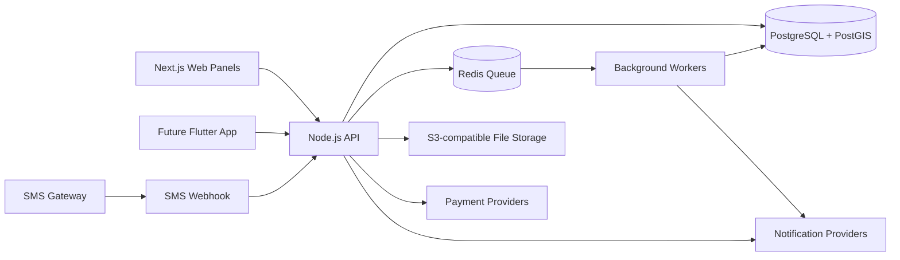

# Technical Architecture

## Architecture Goal

The architecture should support an operations-first launch, a single future Flutter app with role-based access, SMS bookings for feature-phone users, and multi-country expansion.

## High-Level System Design



## Frontend: Next.js

Recommended frontend approach:

- Next.js App Router
- TypeScript
- Tailwind CSS
- shadcn/ui or similar component library
- Server components for read-heavy dashboards
- Client components for maps, assignment drag/drop, proof photo upload, and live tracking
- Role-based route groups for separate panels

Suggested visual style:

- Clean white dashboard background
- Green primary color for sustainability
- Amber warning color for pending manual action
- Red status color for disputes and failed payments
- Card-based dashboard summaries
- Map-first layout for operations and collector tracking
- Photo proof thumbnails embedded in pickup tables

## Backend: Node.js

Recommended backend approach:

- NestJS with TypeScript for a structured enterprise codebase, or Express.js if the team wants a lighter API
- Modular services for countries, users, pickups, collectors, payments, sacks, SMS, reports, and dispatching
- JWT or session-based authentication
- Role-based access control
- Audit logs for admin actions
- Background workers for notifications, SMS parsing, payment verification, reports, and auto-assignment

Suggested service modules:

```text
/apps/api/src
  /auth
  /users
  /countries
  /service-zones
  /customers
  /collectors
  /pickups
  /assignments
  /sacks
  /payments
  /wallets
  /sms
  /reports
  /notifications
  /files
  /audit-logs
```

## Database: PostgreSQL + PostGIS

PostgreSQL is recommended because the platform needs reliable relational data for payments, assignments, users, sacks, countries, and reporting. PostGIS should be enabled for geolocation features such as nearest collector search and service zone matching.

Why PostgreSQL fits this product:

- Strong transactional integrity for payments and wallet balances
- Excellent reporting support
- Relational constraints for marketplace operations
- PostGIS support for latitude/longitude queries
- Easy multi-country modeling with country and currency tables

## Dispatching Strategy

### Phase 1: Manual Assignment

Operations admins assign pickups from the dashboard. This is the safest launch approach because the business can learn operational patterns before automating.

### Phase 2: Assisted Assignment

The system recommends collectors based on:

- Collector approval status
- Online status
- Distance from pickup location
- Current active job count
- Collector rating
- Collector service zone

Admin still confirms or overrides the assignment.

### Phase 3: Automatic Assignment

The system automatically offers the job to the best collector. If the collector rejects or times out, the job is offered to the next best collector.

## Live Tracking

Recommended tracking approach:

- Collectors periodically send location updates from the mobile app or collector web panel
- Backend stores latest location in Redis for fast dashboard access
- Important location events are persisted to PostgreSQL for audit/history
- Operations dashboard subscribes through WebSockets or Server-Sent Events

## Payments

The payment architecture should allow different providers per country.

Ghana priorities:

- MTN Mobile Money
- Telecel Cash / Vodafone Cash
- AirtelTigo Money
- Card payments
- Bank transfer
- Cash reconciliation
- Wallet balance

Payment records should not be tied to one provider. Use a provider-agnostic payment table with provider-specific metadata.

## SMS Processing

SMS should enter the system through provider webhooks. The parser should support simple commands first, then expand over time.

Initial supported commands:

| Command | Purpose |
| --- | --- |
| `PICKUP 1 SACK` | Create one-sack pickup request |
| `PICKUP 3 SACKS` | Create multi-sack pickup request |
| `STATUS <REFERENCE>` | Check pickup status |
| `HELP` | Return available commands |

## Security Requirements

- Password hashing with Argon2 or bcrypt
- Role-based permissions for each panel
- Admin audit logs
- Signed URLs for proof photo uploads and viewing
- Payment webhook signature verification
- Rate limiting for login, SMS webhook, and public booking endpoints
- Country-level data filtering for country managers
- Collector document privacy controls

## Recommended Delivery Phases

| Phase | Focus | Outcome |
| --- | --- | --- |
| Phase 1 | Operations dashboard | Business can manage pickups, collectors, assignments, proof photos, sacks, and basic reports |
| Phase 2 | Core customer and collector web/mobile flows | Customers and collectors can self-serve core actions |
| Phase 3 | Payments and SMS | Mobile money, card, bank transfer, wallet, cash reconciliation, and SMS booking work |
| Phase 4 | Automation and scale | Auto-assignment, live tracking, analytics, and multi-country rollout mature |
